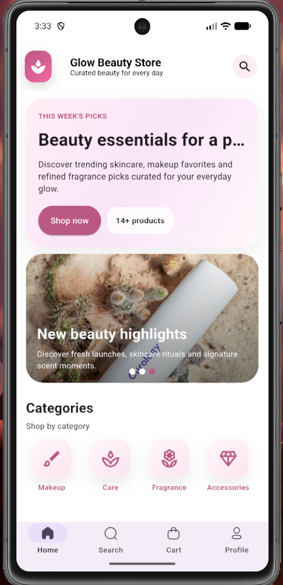
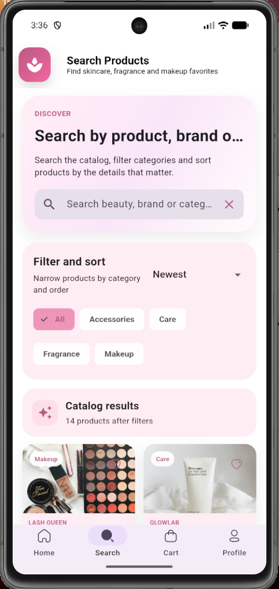
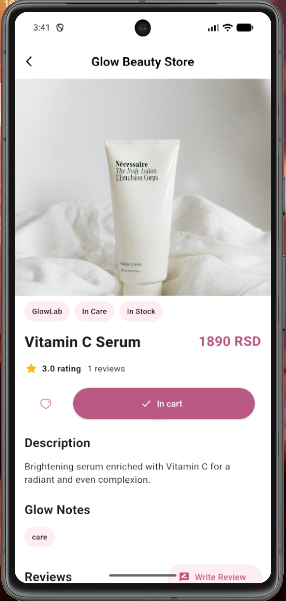
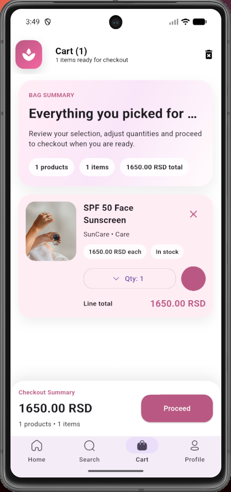
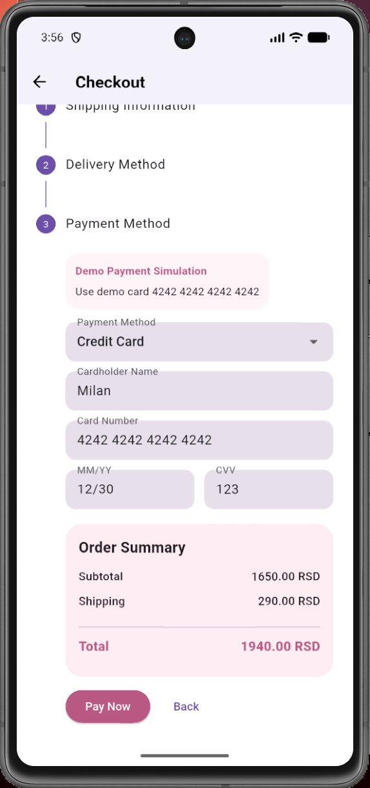
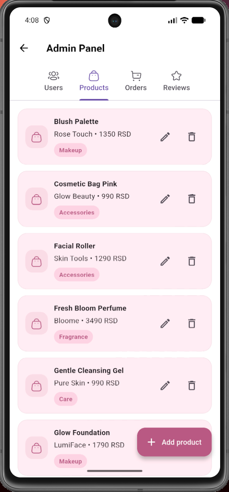

# GlowBeautyStore

GlowBeautyStore is a mobile e-commerce application developed with Flutter and Firebase. The application provides a complete shopping experience for beauty products, together with a separate administrative application for managing products, users, and orders.

## Features

### User Application

- User registration and authentication
- Password reset
- Product browsing and category filtering
- Product search
- Product details
- Shopping cart
- Wishlist
- Checkout
- Order management
- Product reviews
- Saved addresses
- Recently viewed products

### Admin Application

- Admin authentication
- Dashboard
- Product management
- User management
- Order management
- Product creation and editing

## Tech Stack

- **Flutter**
- **Dart**
- **Firebase Authentication**
- **Cloud Firestore**
- **Firebase Storage**
- **Provider** for state management
- External API integration

## Project Structure

The repository contains both the customer-facing application and a separate administrative application.

- `lib/` – main GlowBeautyStore application
- `glowbeautystore_admin/` – administrative application
- `assets/` – application resources and images
- `test/` – application tests

## Architecture

The application uses Provider and ChangeNotifier for state management and Firebase services for authentication, data persistence, and storage.

The application separates UI components, models, services, and state management logic to keep the codebase organized and maintainable.

## Screenshots

### User Application

<p align="center">
  
  
  
</p>

<p align="center">
  
  
</p>

### Admin Application

<p align="center">
  
</p>

## Getting Started

1. Clone the repository:

```bash
git clone https://github.com/NikolinaAzasevac/glowbeautystore.git
```

2. Navigate to the project directory:

```bash
cd glowbeautystore
```

3. Install dependencies:

```bash
flutter pub get
```

4. Run the application:

```bash
flutter run
```

## Author

**Nikolina Azaševac**

Information Systems Engineering Student  
University of Novi Sad – Faculty of Technical Sciences
